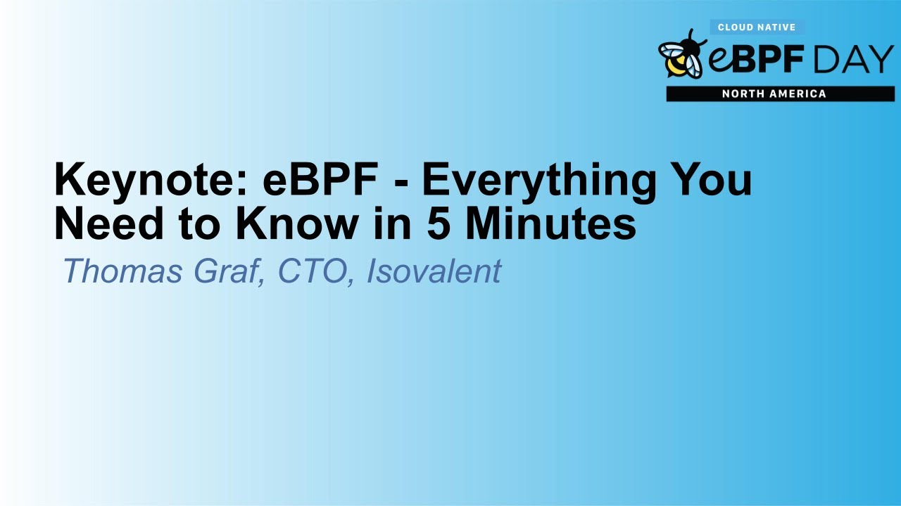

[**Keynote: eBPF - Everything You Need to Know in 5 Minutes - Thomas Graf, CTO, Isovalent**](https://www.youtube.com/watch?v=KhPrMW5Rbbc)

[**`00:00`**](https://www.youtube.com/watch?v=KhPrMW5Rbbc?t=0)
# Introduction to eBPF

In this section, Thomas Graf introduces eBPF and its significance in extending operating systems.

## What is eBPF?

- [**`00:28`**](https://www.youtube.com/watch?v=KhPrMW5Rbbc?t=28) eBPF is a programming language and runtime designed to extend operating systems.
- [**`00:55`**](https://www.youtube.com/watch?v=KhPrMW5Rbbc?t=55) It can be likened to JavaScript or Lua for kernel developers, enabling running programs in the kernel when specific events occur.

## Why eBPF?

- [**`01:49`**](https://www.youtube.com/watch?v=KhPrMW5Rbbc?t=109) Operating systems like Linux are challenging to change quickly, leading to long innovation cycles.
- [**`02:48`**](https://www.youtube.com/watch?v=KhPrMW5Rbbc?t=168) eBPF offers programmability, allowing rapid adaptation to changing requirements and fostering innovation.

[**`03:16`**](https://www.youtube.com/watch?v=KhPrMW5Rbbc?t=196)
# Distinguishing Features of eBPF

This part delves into how eBPF differs from other languages like Lua or WebAssembly and explains its unique characteristics.

## How is eBPF Different?

- [**`03:40`**](https://www.youtube.com/watch?v=KhPrMW5Rbbc?t=220) Unlike Lua or WebAssembly, eBPF is embedded into the operating system, interfacing with the Linux kernel securely.
- [**`04:08`**](https://www.youtube.com/watch?v=KhPrMW5Rbbc?t=248) The key uniqueness of eBPF lies in its integration into the operating system, enhancing security and efficiency.

[**`04:32`**](https://www.youtube.com/watch?v=KhPrMW5Rbbc?t=272)
# Working Mechanism of eBPF

Graf elaborates on the functioning of eBPF through its language, runtime verification, and bytecode compilation process.

## Operational Process

- [**`04:57`**](https://www.youtube.com/watch?v=KhPrMW5Rbbc?t=297) The language used for expressing programs can vary, with C being common; compiled into bytecode for runtime verification.
- [**`05:25`**](https://www.youtube.com/watch?v=KhPrMW5Rbbc?t=325) The runtime embedded in the OS verifies safety, compiles efficiently just-in-time, offering secure execution at specified hook points.

[**`05:49`**](https://www.youtube.com/watch?v=KhPrMW5Rbbc?t=349)
# eBPF Implementation and Usage

Details about who controls the governance of eBFP and where it finds application today are discussed by Graf.

## Governance and Application

- [**`05:49`**](https://www.youtube.com/watch?v=KhPrMW5Rbbc?t=349) The governance of eBFP lies with the EBFP Foundation and open-source communities.

[**`06:50`**](https://www.youtube.com/watch?v=KhPrMW5Rbbc?t=410)
# Detailed Overview of eBPF Usage in Android Operating System

In this section, the speaker discusses the extensive use of eBPF (Extended Berkeley Packet Filter) in the Android operating system for various purposes such as traffic accounting, memory usage tracking, and observability.

## Android's Utilization of eBPF

- [**`06:50`**](https://www.youtube.com/watch?v=KhPrMW5Rbbc?t=410) Android OS employs eBPF for tasks like traffic accounting, CPU and memory usage tracking for applications, and even GPU memory accounting.

## Multi-Cloud Networking with eBPF

- [**`07:18`**](https://www.youtube.com/watch?v=KhPrMW5Rbbc?t=438) Enterprises are leveraging eBPF for multi-cloud networking. An example is S&P Global using eBPF with Sodium to redefine networking paradigms.

## Innovations in Observability through Grafana and I Surveillance Partnership

- [**`07:44`**](https://www.youtube.com/watch?v=KhPrMW5Rbbc?t=464) The partnership between Grafana and I Surveillance aims to enhance observability tools by combining Grafana's expertise with Loki, Tempo, etc., and I Surveillance's sodium tetragon Hubble.

## Enhanced Observability Capabilities Enabled by eBPF

- [**`00:28`**](https://www.youtube.com/watch?v=KhPrMW5Rbbc?t=28) The collaboration introduces new tools for observability. Notable features include embedding Grafana dashboards into Psyllium's Hubble UI for network metrics visualization.

## Security Layer Visibility Enhancement via Tetragon Project

- [**`09:01`**](https://www.youtube.com/watch?v=KhPrMW5Rbbc?t=541) Psyllium's Tetragon project enhances security visibility by displaying process ancestry and application behavior through Grafana toolsets.

--------

## Transcription

- [00:00:02](https://www.youtube.com/watch?v=KhPrMW5Rbbc?t=2) ➜ all right good morning everybody my name
- [00:00:05](https://www.youtube.com/watch?v=KhPrMW5Rbbc?t=5) ➜ is Thomas craft i'm co-founder and CTO
- [00:00:08](https://www.youtube.com/watch?v=KhPrMW5Rbbc?t=8) ➜ of I surveillance but probably more
- [00:00:10](https://www.youtube.com/watch?v=KhPrMW5Rbbc?t=10) ➜ importantly one of the creators of
- [00:00:12](https://www.youtube.com/watch?v=KhPrMW5Rbbc?t=12) ➜ psyllium and currently the chair of the
- [00:00:14](https://www.youtube.com/watch?v=KhPrMW5Rbbc?t=14) ➜ evpf governing board or ebpf Foundation
- [00:00:17](https://www.youtube.com/watch?v=KhPrMW5Rbbc?t=17) ➜ governing board I'm trying to give an
- [00:00:20](https://www.youtube.com/watch?v=KhPrMW5Rbbc?t=20) ➜ introduction to psyllium to ebpf not
- [00:00:23](https://www.youtube.com/watch?v=KhPrMW5Rbbc?t=23) ➜ selling ebpf in five minutes let's see
- [00:00:26](https://www.youtube.com/watch?v=KhPrMW5Rbbc?t=26) ➜ what that gets us
- [00:00:28](https://www.youtube.com/watch?v=KhPrMW5Rbbc?t=28) ➜ first of all what is ebpf how many of
- [00:00:30](https://www.youtube.com/watch?v=KhPrMW5Rbbc?t=30) ➜ you
- [00:00:31](https://www.youtube.com/watch?v=KhPrMW5Rbbc?t=31) ➜ um this is the first ebpf day how many
- [00:00:34](https://www.youtube.com/watch?v=KhPrMW5Rbbc?t=34) ➜ of you have been to an ebpf day before
- [00:00:37](https://www.youtube.com/watch?v=KhPrMW5Rbbc?t=37) ➜ first ebpf day
- [00:00:39](https://www.youtube.com/watch?v=KhPrMW5Rbbc?t=39) ➜ all right quite a few excellent so you
- [00:00:42](https://www.youtube.com/watch?v=KhPrMW5Rbbc?t=42) ➜ may be wondering what is actually BPF
- [00:00:44](https://www.youtube.com/watch?v=KhPrMW5Rbbc?t=44) ➜ and this is the the closest accurate
- [00:00:46](https://www.youtube.com/watch?v=KhPrMW5Rbbc?t=46) ➜ definition I could come to ebpf is a
- [00:00:49](https://www.youtube.com/watch?v=KhPrMW5Rbbc?t=49) ➜ programming language and run time to
- [00:00:52](https://www.youtube.com/watch?v=KhPrMW5Rbbc?t=52) ➜ extend operating systems
- [00:00:55](https://www.youtube.com/watch?v=KhPrMW5Rbbc?t=55) ➜ that sounds very abstract
- [00:00:57](https://www.youtube.com/watch?v=KhPrMW5Rbbc?t=57) ➜ a more practical comparison is ebpf is
- [00:01:02](https://www.youtube.com/watch?v=KhPrMW5Rbbc?t=62) ➜ like JavaScript or Lua
- [00:01:04](https://www.youtube.com/watch?v=KhPrMW5Rbbc?t=64) ➜ but for kernel Developers
- [00:01:07](https://www.youtube.com/watch?v=KhPrMW5Rbbc?t=67) ➜ now maybe you're even more confused so
- [00:01:09](https://www.youtube.com/watch?v=KhPrMW5Rbbc?t=69) ➜ let's look at this
- [00:01:11](https://www.youtube.com/watch?v=KhPrMW5Rbbc?t=71) ➜ on the left we have JavaScript an
- [00:01:13](https://www.youtube.com/watch?v=KhPrMW5Rbbc?t=73) ➜ example of JavaScript how it's commonly
- [00:01:15](https://www.youtube.com/watch?v=KhPrMW5Rbbc?t=75) ➜ used right you use JavaScript to run
- [00:01:17](https://www.youtube.com/watch?v=KhPrMW5Rbbc?t=77) ➜ some code when some event happens for
- [00:01:20](https://www.youtube.com/watch?v=KhPrMW5Rbbc?t=80) ➜ example most common example when the
- [00:01:22](https://www.youtube.com/watch?v=KhPrMW5Rbbc?t=82) ➜ website user clicks on a button it and
- [00:01:24](https://www.youtube.com/watch?v=KhPrMW5Rbbc?t=84) ➜ submits a form
- [00:01:25](https://www.youtube.com/watch?v=KhPrMW5Rbbc?t=85) ➜ on the right side we have ebpf very very
- [00:01:28](https://www.youtube.com/watch?v=KhPrMW5Rbbc?t=88) ➜ similar but you run ebpf programs in the
- [00:01:32](https://www.youtube.com/watch?v=KhPrMW5Rbbc?t=92) ➜ kernel in the operating system when some
- [00:01:34](https://www.youtube.com/watch?v=KhPrMW5Rbbc?t=94) ➜ event happens for example when a system
- [00:01:36](https://www.youtube.com/watch?v=KhPrMW5Rbbc?t=96) ➜ call is being invoked when a network
- [00:01:38](https://www.youtube.com/watch?v=KhPrMW5Rbbc?t=98) ➜ packet is being processed when a file is
- [00:01:40](https://www.youtube.com/watch?v=KhPrMW5Rbbc?t=100) ➜ being accessed and so on so very
- [00:01:42](https://www.youtube.com/watch?v=KhPrMW5Rbbc?t=102) ➜ different layers operating system for
- [00:01:44](https://www.youtube.com/watch?v=KhPrMW5Rbbc?t=104) ➜ ebpf JavaScript lure higher up in the
- [00:01:47](https://www.youtube.com/watch?v=KhPrMW5Rbbc?t=107) ➜ stack but conceptually they're actually
- [00:01:49](https://www.youtube.com/watch?v=KhPrMW5Rbbc?t=109) ➜ very similar they're making systems
- [00:01:51](https://www.youtube.com/watch?v=KhPrMW5Rbbc?t=111) ➜ programmable
- [00:01:56](https://www.youtube.com/watch?v=KhPrMW5Rbbc?t=116) ➜ why ebpf that's the second question I
- [00:01:59](https://www.youtube.com/watch?v=KhPrMW5Rbbc?t=119) ➜ usually get
- [00:02:01](https://www.youtube.com/watch?v=KhPrMW5Rbbc?t=121) ➜ operating systems in particular Linux
- [00:02:04](https://www.youtube.com/watch?v=KhPrMW5Rbbc?t=124) ➜ has become incredibly hard to change it
- [00:02:07](https://www.youtube.com/watch?v=KhPrMW5Rbbc?t=127) ➜ takes weeks or months to even get a
- [00:02:10](https://www.youtube.com/watch?v=KhPrMW5Rbbc?t=130) ➜ change upstream and then years for
- [00:02:12](https://www.youtube.com/watch?v=KhPrMW5Rbbc?t=132) ➜ consumers for users to consume these
- [00:02:15](https://www.youtube.com/watch?v=KhPrMW5Rbbc?t=135) ➜ Linux kernel versions these new versions
- [00:02:16](https://www.youtube.com/watch?v=KhPrMW5Rbbc?t=136) ➜ so the Innovation cycle is very very
- [00:02:20](https://www.youtube.com/watch?v=KhPrMW5Rbbc?t=140) ➜ very long very similar to hardware
- [00:02:23](https://www.youtube.com/watch?v=KhPrMW5Rbbc?t=143) ➜ this leads to this problem that's
- [00:02:25](https://www.youtube.com/watch?v=KhPrMW5Rbbc?t=145) ➜ similar to what we have for CPUs the
- [00:02:28](https://www.youtube.com/watch?v=KhPrMW5Rbbc?t=148) ➜ operating system is essentially using
- [00:02:31](https://www.youtube.com/watch?v=KhPrMW5Rbbc?t=151) ➜ building blocks because it has to
- [00:02:32](https://www.youtube.com/watch?v=KhPrMW5Rbbc?t=152) ➜ predict use cases it cannot adjust adopt
- [00:02:36](https://www.youtube.com/watch?v=KhPrMW5Rbbc?t=156) ➜ to changing requirements all the time
- [00:02:38](https://www.youtube.com/watch?v=KhPrMW5Rbbc?t=158) ➜ that's why the kernel the Linux kernel
- [00:02:40](https://www.youtube.com/watch?v=KhPrMW5Rbbc?t=160) ➜ typically has system subsystems that you
- [00:02:43](https://www.youtube.com/watch?v=KhPrMW5Rbbc?t=163) ➜ as a user can configure you cannot
- [00:02:45](https://www.youtube.com/watch?v=KhPrMW5Rbbc?t=165) ➜ program them for CPUs we have solved
- [00:02:48](https://www.youtube.com/watch?v=KhPrMW5Rbbc?t=168) ➜ these problems with higher level
- [00:02:49](https://www.youtube.com/watch?v=KhPrMW5Rbbc?t=169) ➜ programming languages like Java go rust
- [00:02:52](https://www.youtube.com/watch?v=KhPrMW5Rbbc?t=172) ➜ and so on
- [00:02:53](https://www.youtube.com/watch?v=KhPrMW5Rbbc?t=173) ➜ edpf is the same concept applied to
- [00:02:56](https://www.youtube.com/watch?v=KhPrMW5Rbbc?t=176) ➜ operating system so it gives us
- [00:02:58](https://www.youtube.com/watch?v=KhPrMW5Rbbc?t=178) ➜ programmability and thus allows us to
- [00:03:01](https://www.youtube.com/watch?v=KhPrMW5Rbbc?t=181) ➜ continuously adopt to changing
- [00:03:03](https://www.youtube.com/watch?v=KhPrMW5Rbbc?t=183) ➜ requirements and thus innovate very very
- [00:03:05](https://www.youtube.com/watch?v=KhPrMW5Rbbc?t=185) ➜ quickly that's the biggest fundamental
- [00:03:07](https://www.youtube.com/watch?v=KhPrMW5Rbbc?t=187) ➜ reason why ebpf exists
- [00:03:11](https://www.youtube.com/watch?v=KhPrMW5Rbbc?t=191) ➜ great so we have programmability how is
- [00:03:14](https://www.youtube.com/watch?v=KhPrMW5Rbbc?t=194) ➜ this different to things like Lua or
- [00:03:16](https://www.youtube.com/watch?v=KhPrMW5Rbbc?t=196) ➜ webassembly because there's lots of
- [00:03:18](https://www.youtube.com/watch?v=KhPrMW5Rbbc?t=198) ➜ other languages
- [00:03:19](https://www.youtube.com/watch?v=KhPrMW5Rbbc?t=199) ➜ much much more widely known ones that
- [00:03:22](https://www.youtube.com/watch?v=KhPrMW5Rbbc?t=202) ➜ have been around for ages that give
- [00:03:24](https://www.youtube.com/watch?v=KhPrMW5Rbbc?t=204) ➜ programmability
- [00:03:26](https://www.youtube.com/watch?v=KhPrMW5Rbbc?t=206) ➜ why and how is ebpf different ebpf is
- [00:03:30](https://www.youtube.com/watch?v=KhPrMW5Rbbc?t=210) ➜ specifically designed to be embedded
- [00:03:32](https://www.youtube.com/watch?v=KhPrMW5Rbbc?t=212) ➜ into the operating system Linux and
- [00:03:34](https://www.youtube.com/watch?v=KhPrMW5Rbbc?t=214) ➜ windows it can interface with the Linux
- [00:03:37](https://www.youtube.com/watch?v=KhPrMW5Rbbc?t=217) ➜ kernel so it can call into kernel apis
- [00:03:40](https://www.youtube.com/watch?v=KhPrMW5Rbbc?t=220) ➜ and it is restricted to run safely in
- [00:03:43](https://www.youtube.com/watch?v=KhPrMW5Rbbc?t=223) ➜ the kernel context
- [00:03:45](https://www.youtube.com/watch?v=KhPrMW5Rbbc?t=225) ➜ but it is aimed for kernel developers
- [00:03:47](https://www.youtube.com/watch?v=KhPrMW5Rbbc?t=227) ➜ and thus traditionally very hard to
- [00:03:50](https://www.youtube.com/watch?v=KhPrMW5Rbbc?t=230) ➜ learn and use Lua webassembly on the
- [00:03:52](https://www.youtube.com/watch?v=KhPrMW5Rbbc?t=232) ➜ other hand are designed to be embedded
- [00:03:54](https://www.youtube.com/watch?v=KhPrMW5Rbbc?t=234) ➜ into arbitrary applications or system
- [00:03:56](https://www.youtube.com/watch?v=KhPrMW5Rbbc?t=236) ➜ their general purpose and their aimed
- [00:03:58](https://www.youtube.com/watch?v=KhPrMW5Rbbc?t=238) ➜ application Developers
- [00:04:00](https://www.youtube.com/watch?v=KhPrMW5Rbbc?t=240) ➜ much easier to learn but they cannot run
- [00:04:04](https://www.youtube.com/watch?v=KhPrMW5Rbbc?t=244) ➜ in the context of your of the operating
- [00:04:06](https://www.youtube.com/watch?v=KhPrMW5Rbbc?t=246) ➜ system so the single unique feature of
- [00:04:08](https://www.youtube.com/watch?v=KhPrMW5Rbbc?t=248) ➜ ebpf is that it is embedded into the
- [00:04:10](https://www.youtube.com/watch?v=KhPrMW5Rbbc?t=250) ➜ operating system that what makes our
- [00:04:12](https://www.youtube.com/watch?v=KhPrMW5Rbbc?t=252) ➜ ebpf unique we could for example have
- [00:04:15](https://www.youtube.com/watch?v=KhPrMW5Rbbc?t=255) ➜ chosen Lua as a runtime for the Lewis
- [00:04:18](https://www.youtube.com/watch?v=KhPrMW5Rbbc?t=258) ➜ kernel and give that a name that would
- [00:04:20](https://www.youtube.com/watch?v=KhPrMW5Rbbc?t=260) ➜ be similar to what ebpf is today
- [00:04:23](https://www.youtube.com/watch?v=KhPrMW5Rbbc?t=263) ➜ how does ebpf work there is a language
- [00:04:26](https://www.youtube.com/watch?v=KhPrMW5Rbbc?t=266) ➜ and there is a runtime
- [00:04:28](https://www.youtube.com/watch?v=KhPrMW5Rbbc?t=268) ➜ the language can be expressed in a
- [00:04:30](https://www.youtube.com/watch?v=KhPrMW5Rbbc?t=270) ➜ variety of different languages sudo C
- [00:04:32](https://www.youtube.com/watch?v=KhPrMW5Rbbc?t=272) ➜ code is the the most common one where we
- [00:04:34](https://www.youtube.com/watch?v=KhPrMW5Rbbc?t=274) ➜ use a compiler like llvm or clang to
- [00:04:37](https://www.youtube.com/watch?v=KhPrMW5Rbbc?t=277) ➜ compile that into bytecode but there's
- [00:04:39](https://www.youtube.com/watch?v=KhPrMW5Rbbc?t=279) ➜ several different language Frameworks IR
- [00:04:41](https://www.youtube.com/watch?v=KhPrMW5Rbbc?t=281) ➜ libpf BCC to express ebpf programs in
- [00:04:45](https://www.youtube.com/watch?v=KhPrMW5Rbbc?t=285) ➜ different higher language higher level
- [00:04:47](https://www.youtube.com/watch?v=KhPrMW5Rbbc?t=287) ➜ languages all of this eventually produce
- [00:04:49](https://www.youtube.com/watch?v=KhPrMW5Rbbc?t=289) ➜ so-called ebpf bytecode that is our
- [00:04:52](https://www.youtube.com/watch?v=KhPrMW5Rbbc?t=292) ➜ program
- [00:04:53](https://www.youtube.com/watch?v=KhPrMW5Rbbc?t=293) ➜ then we have a run time this is what's
- [00:04:55](https://www.youtube.com/watch?v=KhPrMW5Rbbc?t=295) ➜ embedded into the operating system the
- [00:04:57](https://www.youtube.com/watch?v=KhPrMW5Rbbc?t=297) ➜ runtime takes the bytecode verifies it
- [00:05:00](https://www.youtube.com/watch?v=KhPrMW5Rbbc?t=300) ➜ to make sure it is safe to run just in
- [00:05:02](https://www.youtube.com/watch?v=KhPrMW5Rbbc?t=302) ➜ time compiles it for efficiency and then
- [00:05:04](https://www.youtube.com/watch?v=KhPrMW5Rbbc?t=304) ➜ runs it at the requested hook points in
- [00:05:07](https://www.youtube.com/watch?v=KhPrMW5Rbbc?t=307) ➜ this example it is being run when system
- [00:05:09](https://www.youtube.com/watch?v=KhPrMW5Rbbc?t=309) ➜ calls are being invoked
- [00:05:12](https://www.youtube.com/watch?v=KhPrMW5Rbbc?t=312) ➜ so these three properties ebpf is secure
- [00:05:15](https://www.youtube.com/watch?v=KhPrMW5Rbbc?t=315) ➜ it has runtime verification it has a
- [00:05:18](https://www.youtube.com/watch?v=KhPrMW5Rbbc?t=318) ➜ Sandbox concept it has program signing
- [00:05:21](https://www.youtube.com/watch?v=KhPrMW5Rbbc?t=321) ➜ it is efficient because it is going
- [00:05:22](https://www.youtube.com/watch?v=KhPrMW5Rbbc?t=322) ➜ through a just in time compiler it is
- [00:05:25](https://www.youtube.com/watch?v=KhPrMW5Rbbc?t=325) ➜ embedded into the operating system and
- [00:05:27](https://www.youtube.com/watch?v=KhPrMW5Rbbc?t=327) ➜ it offers per CPU data structures and it
- [00:05:30](https://www.youtube.com/watch?v=KhPrMW5Rbbc?t=330) ➜ portable the bytecode is generic it gets
- [00:05:33](https://www.youtube.com/watch?v=KhPrMW5Rbbc?t=333) ➜ just in time compiled later on it has
- [00:05:35](https://www.youtube.com/watch?v=KhPrMW5Rbbc?t=335) ➜ data type Discovery BTF as well as a
- [00:05:38](https://www.youtube.com/watch?v=KhPrMW5Rbbc?t=338) ➜ stable API how to interface with the
- [00:05:40](https://www.youtube.com/watch?v=KhPrMW5Rbbc?t=340) ➜ operating system
- [00:05:42](https://www.youtube.com/watch?v=KhPrMW5Rbbc?t=342) ➜ who controls evpf evpf is controlled by
- [00:05:46](https://www.youtube.com/watch?v=KhPrMW5Rbbc?t=346) ➜ the ebpf foundation and the open source
- [00:05:49](https://www.youtube.com/watch?v=KhPrMW5Rbbc?t=349) ➜ communities around it if you are
- [00:05:51](https://www.youtube.com/watch?v=KhPrMW5Rbbc?t=351) ➜ interested in participating on the
- [00:05:53](https://www.youtube.com/watch?v=KhPrMW5Rbbc?t=353) ➜ governance side of ebpf foundation feel
- [00:05:55](https://www.youtube.com/watch?v=KhPrMW5Rbbc?t=355) ➜ free to go to ebpf.foundation
- [00:06:00](https://www.youtube.com/watch?v=KhPrMW5Rbbc?t=360) ➜ that's that's nice now we know about
- [00:06:02](https://www.youtube.com/watch?v=KhPrMW5Rbbc?t=362) ➜ ebpf is where is ebpf used today this
- [00:06:04](https://www.youtube.com/watch?v=KhPrMW5Rbbc?t=364) ➜ may actually be a surprise it's
- [00:06:06](https://www.youtube.com/watch?v=KhPrMW5Rbbc?t=366) ➜ incredibly widely used we could look at
- [00:06:09](https://www.youtube.com/watch?v=KhPrMW5Rbbc?t=369) ➜ the psyllium users file it's everywhere
- [00:06:10](https://www.youtube.com/watch?v=KhPrMW5Rbbc?t=370) ➜ but that's kind of boring lots of logos
- [00:06:12](https://www.youtube.com/watch?v=KhPrMW5Rbbc?t=372) ➜ let's look at some more extreme use
- [00:06:15](https://www.youtube.com/watch?v=KhPrMW5Rbbc?t=375) ➜ cases
- [00:06:16](https://www.youtube.com/watch?v=KhPrMW5Rbbc?t=376) ➜ Cloud native landscape we see a couple
- [00:06:18](https://www.youtube.com/watch?v=KhPrMW5Rbbc?t=378) ➜ of projects using evpf but let's dive
- [00:06:20](https://www.youtube.com/watch?v=KhPrMW5Rbbc?t=380) ➜ deeper and look at like heavy
- [00:06:22](https://www.youtube.com/watch?v=KhPrMW5Rbbc?t=382) ➜ applications of ebpf that you probably
- [00:06:24](https://www.youtube.com/watch?v=KhPrMW5Rbbc?t=384) ➜ use every day
- [00:06:26](https://www.youtube.com/watch?v=KhPrMW5Rbbc?t=386) ➜ facebook slash meta is using ebpr for
- [00:06:28](https://www.youtube.com/watch?v=KhPrMW5Rbbc?t=388) ➜ load balancing it's called project
- [00:06:30](https://www.youtube.com/watch?v=KhPrMW5Rbbc?t=390) ➜ katron it's been used in production from
- [00:06:32](https://www.youtube.com/watch?v=KhPrMW5Rbbc?t=392) ➜ for for several years all ebpf Facebook
- [00:06:35](https://www.youtube.com/watch?v=KhPrMW5Rbbc?t=395) ➜ is using this exclusively for all load
- [00:06:38](https://www.youtube.com/watch?v=KhPrMW5Rbbc?t=398) ➜ balancing needs we have all three big
- [00:06:41](https://www.youtube.com/watch?v=KhPrMW5Rbbc?t=401) ➜ cloud providers AWS Azure Google Cloud
- [00:06:44](https://www.youtube.com/watch?v=KhPrMW5Rbbc?t=404) ➜ using Solium in their managed kuberous
- [00:06:46](https://www.youtube.com/watch?v=KhPrMW5Rbbc?t=406) ➜ offerings many of you probably use a
- [00:06:48](https://www.youtube.com/watch?v=KhPrMW5Rbbc?t=408) ➜ managed kubernetes offering gke eks AKs
- [00:06:50](https://www.youtube.com/watch?v=KhPrMW5Rbbc?t=410) ➜ at some point they are using psyllium
- [00:06:52](https://www.youtube.com/watch?v=KhPrMW5Rbbc?t=412) ➜ and thus ebpf underneath
- [00:06:55](https://www.youtube.com/watch?v=KhPrMW5Rbbc?t=415) ➜ but even smartphones this is the evpf
- [00:06:58](https://www.youtube.com/watch?v=KhPrMW5Rbbc?t=418) ➜ page of the Android operating system
- [00:07:00](https://www.youtube.com/watch?v=KhPrMW5Rbbc?t=420) ➜ Android uses ebpf it has an ebpf loader
- [00:07:03](https://www.youtube.com/watch?v=KhPrMW5Rbbc?t=423) ➜ and it uses ebpf pro ebpf programs to do
- [00:07:06](https://www.youtube.com/watch?v=KhPrMW5Rbbc?t=426) ➜ traffic accounting it uses it to account
- [00:07:08](https://www.youtube.com/watch?v=KhPrMW5Rbbc?t=428) ➜ how much CPU memory each app uses and
- [00:07:11](https://www.youtube.com/watch?v=KhPrMW5Rbbc?t=431) ➜ can even do GPU memory accounting and so
- [00:07:13](https://www.youtube.com/watch?v=KhPrMW5Rbbc?t=433) ➜ on it's all done using eppf so when you
- [00:07:16](https://www.youtube.com/watch?v=KhPrMW5Rbbc?t=436) ➜ look at the traffic statistic of your
- [00:07:18](https://www.youtube.com/watch?v=KhPrMW5Rbbc?t=438) ➜ app how much traffic volume how much
- [00:07:19](https://www.youtube.com/watch?v=KhPrMW5Rbbc?t=439) ➜ Network volume it it consumed that was
- [00:07:22](https://www.youtube.com/watch?v=KhPrMW5Rbbc?t=442) ➜ counted using BPF
- [00:07:24](https://www.youtube.com/watch?v=KhPrMW5Rbbc?t=444) ➜ multi-cloud networking Enterprises there
- [00:07:27](https://www.youtube.com/watch?v=KhPrMW5Rbbc?t=447) ➜ was a fantastic presentation at ebpf
- [00:07:29](https://www.youtube.com/watch?v=KhPrMW5Rbbc?t=449) ➜ Summit a couple of weeks back where s p
- [00:07:32](https://www.youtube.com/watch?v=KhPrMW5Rbbc?t=452) ➜ Global presented how they're using ebpf
- [00:07:34](https://www.youtube.com/watch?v=KhPrMW5Rbbc?t=454) ➜ with sodium for a multi-cloud networking
- [00:07:37](https://www.youtube.com/watch?v=KhPrMW5Rbbc?t=457) ➜ layer to essentially redefine how they
- [00:07:39](https://www.youtube.com/watch?v=KhPrMW5Rbbc?t=459) ➜ think about networking the talk was
- [00:07:41](https://www.youtube.com/watch?v=KhPrMW5Rbbc?t=461) ➜ absolutely fantastic a road to invisible
- [00:07:44](https://www.youtube.com/watch?v=KhPrMW5Rbbc?t=464) ➜ Network smp's Global Network
- [00:07:45](https://www.youtube.com/watch?v=KhPrMW5Rbbc?t=465) ➜ transformation Journey you can go to
- [00:07:47](https://www.youtube.com/watch?v=KhPrMW5Rbbc?t=467) ➜ ebpf.io click on watch Summit recordings
- [00:07:50](https://www.youtube.com/watch?v=KhPrMW5Rbbc?t=470) ➜ and you will find a talk the talk
- [00:07:52](https://www.youtube.com/watch?v=KhPrMW5Rbbc?t=472) ➜ recording
- [00:07:54](https://www.youtube.com/watch?v=KhPrMW5Rbbc?t=474) ➜ but there is one more thing because the
- [00:07:56](https://www.youtube.com/watch?v=KhPrMW5Rbbc?t=476) ➜ biggest aspect of eppf where I think
- [00:07:59](https://www.youtube.com/watch?v=KhPrMW5Rbbc?t=479) ➜ we'll see a lot more Innovation going
- [00:08:00](https://www.youtube.com/watch?v=KhPrMW5Rbbc?t=480) ➜ forward is observability
- [00:08:03](https://www.youtube.com/watch?v=KhPrMW5Rbbc?t=483) ➜ so really happy to announce a absolutely
- [00:08:06](https://www.youtube.com/watch?v=KhPrMW5Rbbc?t=486) ➜ fantastic new uh partnership between
- [00:08:08](https://www.youtube.com/watch?v=KhPrMW5Rbbc?t=488) ➜ grafana and I surveillance grafana is
- [00:08:12](https://www.youtube.com/watch?v=KhPrMW5Rbbc?t=492) ➜ bringing their entire observability
- [00:08:13](https://www.youtube.com/watch?v=KhPrMW5Rbbc?t=493) ➜ knowledge and tools at Loki grafana
- [00:08:16](https://www.youtube.com/watch?v=KhPrMW5Rbbc?t=496) ➜ Tempo and so on and I surveillance is
- [00:08:18](https://www.youtube.com/watch?v=KhPrMW5Rbbc?t=498) ➜ bringing sodium tetragon Hubble for for
- [00:08:21](https://www.youtube.com/watch?v=KhPrMW5Rbbc?t=501) ➜ observability and all of our ebpf
- [00:08:24](https://www.youtube.com/watch?v=KhPrMW5Rbbc?t=504) ➜ knowledge and together we're building a
- [00:08:26](https://www.youtube.com/watch?v=KhPrMW5Rbbc?t=506) ➜ new set of tools that you can use for
- [00:08:28](https://www.youtube.com/watch?v=KhPrMW5Rbbc?t=508) ➜ observability
- [00:08:30](https://www.youtube.com/watch?v=KhPrMW5Rbbc?t=510) ➜ a couple of examples Network
- [00:08:32](https://www.youtube.com/watch?v=KhPrMW5Rbbc?t=512) ➜ observability where you we can now embed
- [00:08:35](https://www.youtube.com/watch?v=KhPrMW5Rbbc?t=515) ➜ grafana dashboards directly into
- [00:08:37](https://www.youtube.com/watch?v=KhPrMW5Rbbc?t=517) ➜ psyllium's Hubble UI for amazing Network
- [00:08:39](https://www.youtube.com/watch?v=KhPrMW5Rbbc?t=519) ➜ observability metrics for traffic volume
- [00:08:42](https://www.youtube.com/watch?v=KhPrMW5Rbbc?t=522) ➜ Network policy drops traffic volume and
- [00:08:46](https://www.youtube.com/watch?v=KhPrMW5Rbbc?t=526) ➜ so on
- [00:08:47](https://www.youtube.com/watch?v=KhPrMW5Rbbc?t=527) ➜ but there is more we can also do ebpf
- [00:08:49](https://www.youtube.com/watch?v=KhPrMW5Rbbc?t=529) ➜ based HTTP tracing and HTTP
- [00:08:51](https://www.youtube.com/watch?v=KhPrMW5Rbbc?t=531) ➜ observability and for example build
- [00:08:53](https://www.youtube.com/watch?v=KhPrMW5Rbbc?t=533) ➜ golden signal dashboards that we see on
- [00:08:55](https://www.youtube.com/watch?v=KhPrMW5Rbbc?t=535) ➜ the right side of the screen as well as
- [00:08:57](https://www.youtube.com/watch?v=KhPrMW5Rbbc?t=537) ➜ integration in the grafana tempo where
- [00:08:59](https://www.youtube.com/watch?v=KhPrMW5Rbbc?t=539) ➜ we can trace individual HTTP requests
- [00:09:01](https://www.youtube.com/watch?v=KhPrMW5Rbbc?t=541) ➜ all thanks to ebpf and those without
- [00:09:04](https://www.youtube.com/watch?v=KhPrMW5Rbbc?t=544) ➜ sidecars without proxies at all very
- [00:09:06](https://www.youtube.com/watch?v=KhPrMW5Rbbc?t=546) ➜ very fascinating and last but not least
- [00:09:09](https://www.youtube.com/watch?v=KhPrMW5Rbbc?t=549) ➜ because of because of tilium's tetragon
- [00:09:11](https://www.youtube.com/watch?v=KhPrMW5Rbbc?t=551) ➜ project we also have excellent
- [00:09:13](https://www.youtube.com/watch?v=KhPrMW5Rbbc?t=553) ➜ visibility into the security layer and
- [00:09:15](https://www.youtube.com/watch?v=KhPrMW5Rbbc?t=555) ➜ can for example display process ancestry
- [00:09:19](https://www.youtube.com/watch?v=KhPrMW5Rbbc?t=559) ➜ how how applications behave and what
- [00:09:22](https://www.youtube.com/watch?v=KhPrMW5Rbbc?t=562) ➜ commands they execute and visualize that
- [00:09:24](https://www.youtube.com/watch?v=KhPrMW5Rbbc?t=564) ➜ in uh in a grafana tool sets as well as
- [00:09:27](https://www.youtube.com/watch?v=KhPrMW5Rbbc?t=567) ➜ well as things like TLS handshake
- [00:09:29](https://www.youtube.com/watch?v=KhPrMW5Rbbc?t=569) ➜ monitoring
- [00:09:32](https://www.youtube.com/watch?v=KhPrMW5Rbbc?t=572) ➜ this was a five minute introduction to
- [00:09:34](https://www.youtube.com/watch?v=KhPrMW5Rbbc?t=574) ➜ to ebpf and um I tried to to use a
- [00:09:37](https://www.youtube.com/watch?v=KhPrMW5Rbbc?t=577) ➜ couple of real world examples as well
- [00:09:39](https://www.youtube.com/watch?v=KhPrMW5Rbbc?t=579) ➜ ebpf is already everywhere and we're
- [00:09:41](https://www.youtube.com/watch?v=KhPrMW5Rbbc?t=581) ➜ using it every day but there's lots of
- [00:09:43](https://www.youtube.com/watch?v=KhPrMW5Rbbc?t=583) ➜ more exciting things coming and I'm
- [00:09:45](https://www.youtube.com/watch?v=KhPrMW5Rbbc?t=585) ➜ looking forward to the to a whole day of
- [00:09:47](https://www.youtube.com/watch?v=KhPrMW5Rbbc?t=587) ➜ um presentations thanks a lot everybody
